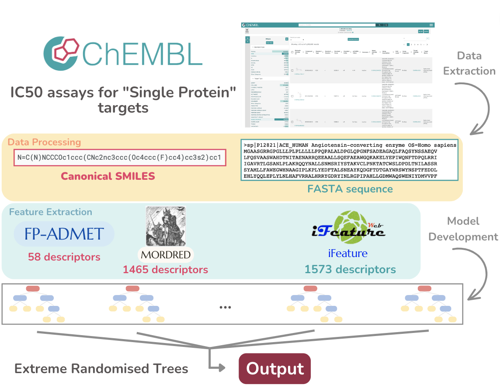

## ICARO<sub>ERT</sub> (IC<sub>50</sub> binding Affinity Regression Optimized)

## Abstract: 
The search for new pharmaceutical products has become increasingly difficult and expensive, leading the pharmaceutical industry to explore alternative methods of drug discovery. One approach involves using computational methods to reduce the number of compounds during the early stages of drug development. Protein-ligand interactions play a crucial role in understanding the mechanisms of drug action. Therefore, there is great interest in developing computational methods for determining drug-target binding affinity in the form of inhibitory concentrations (IC<sub>50</sub>), inhibition constants (Ki), or dissociation constants (K<sub>d</sub>) for hit recognition. Although several predictors have been developed, they mainly focus on K<sub>i</sub>and K<sub>d</sub>, and are restricted to interactions involving kinases. Therefore, a general algorithm that can predict the IC<sub>50</sub> values for different targets is required. Here, we propose ICARO<sub>ERT</sub> (IC<sub>50</sub> binding Affinity Regression Optimized) for drug-target binding affinity prediction, which is expressed as pIC<sub>50</sub>. ICARO<sub>ERT</sub> achieved a coefficient of determination (R<sup>2</sup>) value of 0.726, root mean squared error (RMSE) of 0.701, Pearson correlation coefficient (PCC) of 0.855, and concordance index (CI) of 0.837. ICARO<sub>ERT</sub> is an efficient and cost-effective method for drug discovery.

⁩

### Prerequisites:
ICARO<sub>ERT</sub> was developed and tested as follows:
> Python 3.6.9 (default, Mar 10 2023, 16:46:00)

We recommend creating an isolated Conda environment to run our pipeline, which can be performed using the following code:
> conda create --name icaro python=3.6.9

> conda activate icaro

Note: The environment name, defined after the "--name" argument in the first step, can be whatever the user desires.

### Requirements:
These requirements can be installed using pip.
* iFeature - GitHub available at https://github.com/Superzchen/iFeature. You should download the iFeature folder and paste it into this git home directory.
* fp-admet - Github available at https://github.com/jcheminform/fpadmet. Folder is already included in this GitHub.
* MORDRED - version 1.2.0 .
* numpy - version 1.26.0 .
* pandas - version 2.1.1 .
* scikit-learn - version 1.3.1 .
* lifelines - version 0.27.8 .
* scipy - version 1.11.3 .
* h5py - version 3.9.0 .
* xgboost - version 2.0.2 .


Required information to replicate ICARO<sub>ERT</sub>: an ensemble of Extreme Randomized Trees for Prediction of Protein-Ligand IC<sub>50</sub> is described in this Repository.

### Study Replication:
A) Dataset files:
 1) IC50_values.csv - The main dataset where Protein-Ligand Interactions (PLI) and their pIC50 binding affinities are described, as well as some useful information on the protein and ligand involved in each interaction.
 2) unique_uniprotid.fa - A FASTA file representing all the unique protein sequences, included in the main IC50_values.csv dataset.

B) Script files:
After performing the changes previously indicated and properly installing and setting up the environment, these scripts should simply run without requiring changes.
 0) **```icaro_resources.py```** - Includes several variables and functions that will be called throughout the pipeline.
 1) **```1_dataset_split.py```** - Dataset split script, creating a training, test, and validation set. Each subset is written as a txt file with unique proteins, ligands, and interactions included in each set.
 2) **```2_FeatureExtraction_ifeature.py```** - Retrieves iFeature protein features. From a fasta file with protein sequences from a dataset, it exports ifeature protein features.
 3) **```2_Normalization_ifeature.py```** - iFeature feature normalization script that receives a txt file of training, test, and validation proteins and writes a h5 file with iFeature descriptors normalized by training features.
 4) **```3_FeatureExtraction_mordred.py```** - Retrieves MORDRED ligand features. From ligand's smiles available at the "Canonical Smiles" column from the main dataset, it exports MORDRED features in a h5 file.
 5) **```4_fp_admet.sh```** - Retrieves fp-ADMET ligand descriptors. 
 6) **```4_Normalization_fp_admet.py```** - fp-ADMET descriptors normalization. It receives a txt file of ligands in the training, testing, and validation sets, and writes a h5 file with ADMET descriptors normalized by training features.
 7) **```5_FeatureExtraction_prt_family.py```** - Constructs a one-hot encoding feature regarding protein family, based on ChEMBL's classification. The script accepts two csv files: one with the protein ID ("single_proteins_id_noduplicate.csv") and other with the ChEMBL's family classification ("targets_family.csv"). It writes a .txt for each family name and a. h5 file to save the corresponding values.

C) Model training and testing (the 3 best models are included here):
 1) **```6_model_random_forest.py```** - Trains a Random Forest (RF) model from h5 feature files from training data and tests them on test and validation sets.
 2) **```6_model_xgboost.py```** - Trains an Extreme Gradient Boosting algorithm from h5 feature files from training data and tests them on test and validation sets.
 3) **```6_model_xtrees.py```** - Trains an Ensemble of Extreme Randomized Trees from h5 feature files from training data and tests them on test and validation sets.

### Please Cite:
[Ana T. Gaspar, Catarina Marques-Pereira, António J. Preto and Irina S. Moreira - ICARO: IC<sub>50</sub> binding Affinity Regression Opti-mized] PENDING CITATION
